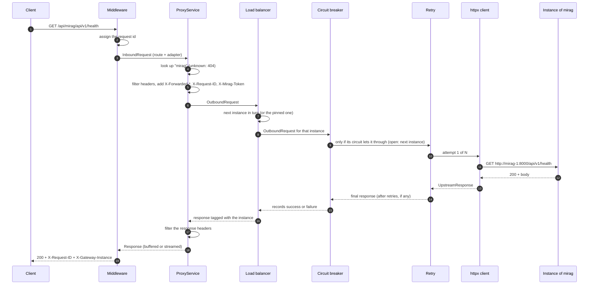
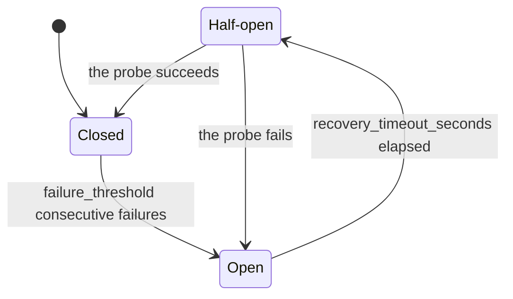
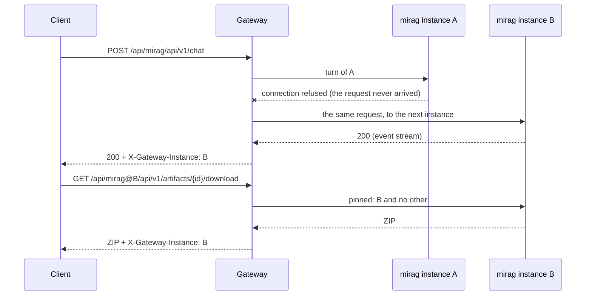
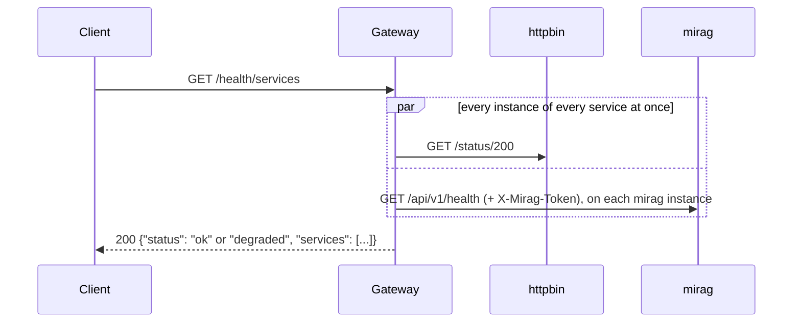
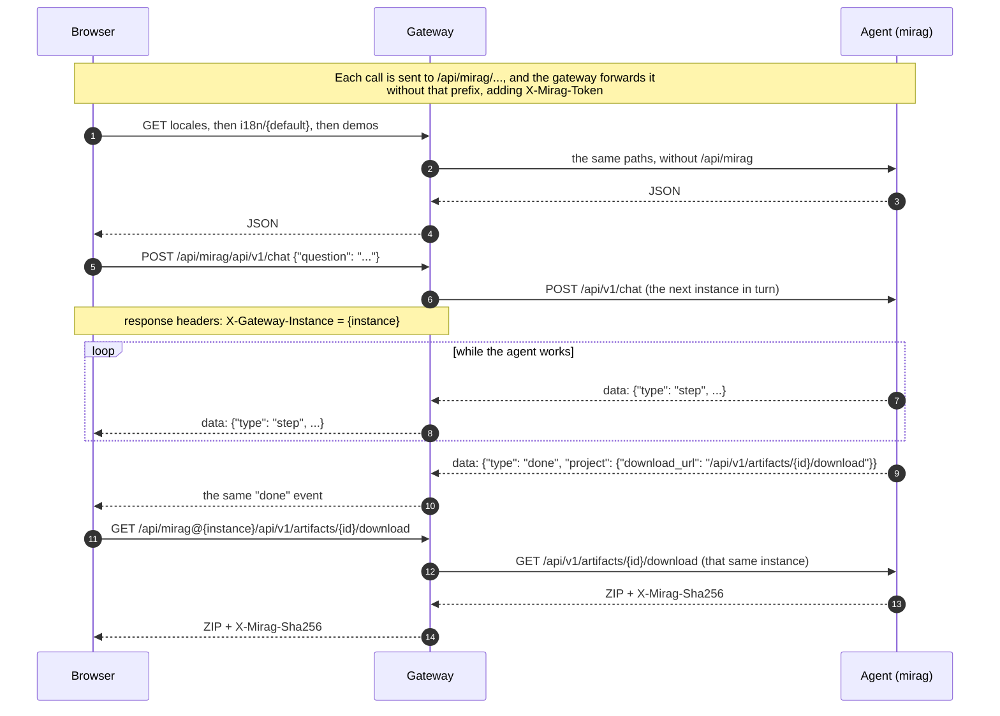

# API Gateway

A Python server (FastAPI + httpx) that acts as an **intermediary** between clients and
microservices. It receives requests at `/api/{service}/{path}` and forwards them to
`{service base_url}/{path}`, adding resilience (retries and a circuit breaker), traceability
(request ids) and health checks. A service can run on several servers at once: the gateway
spreads requests among them and moves on to another one when a server fails.

```
Client ──► GET /api/users/items/1 ──► Gateway ──► GET http://users:8001/items/1
```

## Features

- **Transparent proxy**: method, query params, body and headers (including repeated ones such as
  `Set-Cookie`). Strips *hop-by-hop* headers and adds `X-Forwarded-For/Proto/Host`.
- **Server-Sent Events streaming**: `text/event-stream` responses reach the client event by event
  as the microservice produces them, instead of all at once at the end.
- **Per-service credentials**: headers configured for a service (e.g. a shared secret) are added
  to every request sent to it and replace any header of the same name sent by the client, so the
  secret never reaches a browser.
- **Retries** with exponential backoff, only for idempotent methods (`GET`, `PUT`, `DELETE`, …).
  `POST` and `PATCH` are never retried, so side effects are never duplicated.
- **Several instances per service**: requests are spread round-robin among the servers of a
  service, and one that is down or failing is skipped. `X-Gateway-Instance` names the server
  that answered, and `/api/{service}@{instance}/...` goes back to it (see
  [Several instances of a service](#several-instances-of-a-service)).
- **Per-instance circuit breaker**: when a server keeps failing, the gateway stops calling it for
  a while, without affecting the other services or the other instances of the same one. `503`
  only when every instance of the service is in that state.
- **Request ID**: reuses the incoming `X-Request-ID` (when it is safe) or generates one; it is
  propagated to the microservice, returned to the client and included in every log line.
- **Consistent JSON errors**: `404` unknown service, `502` unreachable service, `503` open
  circuit, `504` timeout.
- **Health checks**: `/health` (liveness) and `/health/services` (status of each microservice).
- **Swagger / OpenAPI**: `/docs` documents the gateway's endpoints, the generic proxy and the
  agent's routes as clients call them (see [Endpoints and Swagger](#endpoints-and-swagger)).

## Architecture

```
src/gateway/
├── domain/            # Models, errors and ports (interfaces). No external dependencies.
│   ├── models.py
│   ├── exceptions.py
│   └── ports.py       # ServiceRegistry, UpstreamClient (ABCs)
├── application/       # Use cases: depend only on the ports.
│   ├── proxy_service.py
│   ├── health_service.py
│   └── header_policy.py
├── infrastructure/    # Concrete implementations of the ports.
│   ├── registry.py            # InMemoryServiceRegistry
│   ├── httpx_client.py        # HttpxUpstreamClient
│   └── resilience/
│       ├── load_balancer.py   # LoadBalancingUpstreamClient (decorator)
│       ├── circuit_breaker.py # CircuitBreakerUpstreamClient (decorator)
│       └── retry.py           # RetryingUpstreamClient (decorator)
├── api/               # HTTP layer (FastAPI): routes, middleware, errors, adapters.
│   ├── openapi.py     # The OpenAPI document behind Swagger UI.
│   └── contracts/     # Routes of downstream services documented in Swagger (mirag.py).
├── config/settings.py # Typed configuration (pydantic-settings).
├── bootstrap.py       # Composition root: the only place that knows the concrete classes.
└── main.py            # Entry point.
```

Dependencies always point inwards: `api → application → domain ← infrastructure`.

The call chain to a microservice is built from decorators that all implement the same
`UpstreamClient` interface:

```
ProxyService ─► LoadBalancing ─► CircuitBreaker ─► Retrying ─► HttpxUpstreamClient ─► network
                 (picks the      (one per          (same
                  instance)       instance)         instance)
```

### SOLID principles

| Principle | Where |
|---|---|
| **S** — Single responsibility | Each class does one thing: `HeaderPolicy` filters headers, `LoadBalancingUpstreamClient` picks an instance, `RetryingUpstreamClient` retries, `CircuitBreaker` manages states, `InMemoryServiceRegistry` resolves services, `ProxyService` orchestrates. |
| **O** — Open/closed | New behavior means a new class. E.g. adding rate limiting or caching is writing another `UpstreamClient` decorator and registering it in `bootstrap.py`, without touching `ProxyService`. A new HTTP error is one entry in `api/errors.py`. |
| **L** — Liskov substitution | `HttpxUpstreamClient`, the resilience decorators and the test fakes are interchangeable because they honor the `UpstreamClient` contract (they raise `UpstreamError`, never httpx exceptions). |
| **I** — Interface segregation | Small, focused ports: `ServiceRegistry` (2 methods) and `UpstreamClient` (1 method). |
| **D** — Dependency inversion | `ProxyService` and `HealthService` receive abstractions through their constructors. Concrete implementations are only instantiated in `bootstrap.py`. |

## How a request flows

### The path of a proxied request

Every request to `/api/{service}/{path}` takes the same path. With `GET /api/mirag/api/v1/health`
as the example:



1. **Request id** (`api/middleware.py`). The incoming `X-Request-ID` is kept if it matches
   `[A-Za-z0-9._-]{1,128}`; otherwise a new one is generated. From here on every log line
   carries it.
2. **Routing** (`api/routes/proxy.py`). `/api/{service}/{path}` accepts `GET`, `POST`, `PUT`,
   `PATCH`, `DELETE`, `HEAD` and `OPTIONS`. `/api/{service}` alone reaches the root of the
   service, and `/api/{service}@{instance}/...` pins the request to one instance.
   `/health`, `/docs`, `/redoc` and `/openapi.json` are the gateway's own routes.
3. **Adapter** (`api/adapters.py`). The request becomes an `InboundRequest`, free of framework
   types. The request body is read whole here.
4. **Service lookup** (`application/proxy_service.py`). The registry resolves the name. An
   unknown service ends the request with `404 service_not_found`, and an unknown pinned
   instance with `404 instance_not_found`, without calling anything.
5. **Request headers** (`application/header_policy.py`): see [Headers](#headers).
6. **Instance choice** (`infrastructure/resilience/load_balancer.py`). The next instance of the
   service in turn, or the pinned one. See
   [Several instances of a service](#several-instances-of-a-service).
7. **Circuit breaker** (`infrastructure/resilience/circuit_breaker.py`). One per instance. An
   instance whose circuit is open is skipped; when all of them are, the request ends with
   `503 service_unavailable`.
8. **Retries** (`infrastructure/resilience/retry.py`). Idempotent methods only, on the same
   instance: see [Retries](#retries).
9. **HTTP call** (`infrastructure/httpx_client.py`). The URL is the instance's
   `base_url + "/" + path`, with the path re-encoded and the query string passed through.
   Redirects are not followed: a `3xx` reaches the client as it is. A timeout becomes `504` and
   any other network error `502`.
10. **Response headers**: filtered again on the way back.
11. **Response** (`api/adapters.py`). Buffered, or streamed for Server-Sent Events (see
    [Buffered and streamed responses](#buffered-and-streamed-responses)). Repeated headers
    such as `Set-Cookie` are preserved, and `X-Gateway-Instance` names the instance.
12. **Back to the client**. The middleware adds `X-Request-ID` to the response and logs one line:
    `GET /api/mirag/api/v1/health -> 200 (12.3 ms)`.

The status and body the service answers reach the client unchanged, and so do its headers
except the ones filtered above. Errors included: a `400` from the agent is still that same
`400`. The gateway only writes a response of its own when it could not get one (see
[Errors](#errors)).

### Headers

| Direction | Removed | Added |
|---|---|---|
| Client → service | Hop-by-hop headers (`Connection`, `Keep-Alive`, `Proxy-Authenticate`, `Proxy-Authorization`, `TE`, `Trailer`, `Transfer-Encoding`, `Upgrade`, and any header listed in `Connection`). `Host` and `Content-Length`, which httpx recomputes. The client's `X-Forwarded-*` and `X-Request-ID`, which the gateway rewrites so they cannot be spoofed. Any header with the name of a configured service header. | `X-Forwarded-For` (the incoming chain plus the client address), `X-Forwarded-Proto`, `X-Forwarded-Host`, `X-Request-ID`, and the service's configured `headers` (e.g. `X-Mirag-Token`). |
| Service → client | Hop-by-hop headers. `Content-Encoding` and `Content-Length`: httpx already decompressed the body, so they no longer describe it. A service's own `X-Gateway-Instance`, which the gateway overwrites. | `X-Request-ID`, `X-Gateway-Instance` (the instance that answered), and `X-Accel-Buffering: no` on streams so that a reverse proxy in front does not buffer them. |

### Buffered and streamed responses

- A response with `Content-Type: text/event-stream` is **streamed**: every chunk goes to the
  client as soon as it arrives. The service's `timeout_seconds` applies to each wait for the
  next chunk, not to the whole stream.
- Any other response is **buffered**: the gateway reads the whole body, then sends it.
- Request bodies are always buffered.
- Retries and the circuit breaker only see the start of a stream (status and headers). A
  stream cut halfway is neither retried nor counted as a failure: the status line is already
  sent, so the gateway ends the stream and logs `Stream from '<service>' ended early`. The
  client notices because the stream ends without its last event (`done` for the agent).

### Retries

- Only idempotent methods are retried: `GET`, `HEAD`, `OPTIONS`, `PUT`, `DELETE`. `POST` and
  `PATCH` are sent exactly once, because repeating them could duplicate a side effect.
- A retry happens on a connection error, a timeout, or a status in `retry_on_status` (`502`,
  `503`, `504` by default).
- `max_attempts` counts every attempt (default 3). Between them the gateway waits
  `base_delay_seconds * 2^(attempt - 1)`, capped at `max_delay_seconds`: 0.1 s, then 0.2 s with
  the defaults.
- Retries stay on the same instance. When they run out, a failed request can still move on to
  another instance (see [Several instances of a service](#several-instances-of-a-service));
  otherwise the client receives the last result: the gateway's `502`/`504`, or the service's
  own last response (e.g. its `503`).
- Every retry logs a warning: `Retrying GET http://... after status 503 (attempt 1/3, waiting 0.10s)`.

### Circuit breaker



There is one circuit per **instance**: a server that fails does not take down the other
services, nor the other servers of its own service.

- **Closed**: requests flow. A *failure* is a connection error, a timeout, or a status in
  `failure_status_codes` (`502`, `503`, `504`). It is counted **after** the retries, so a
  whole sequence of failed attempts counts as one failure. Any other answer (`4xx` and `500`
  included) counts as a success and resets the count.
- **Open**: the instance is not called. Its requests go to the other instances; when every
  instance of the service is open, the client gets `503 service_unavailable` at once.
- **Half-open**: once `recovery_timeout_seconds` pass, a single probe request goes through
  (the rest keep skipping that instance while it is in flight). Its outcome closes or reopens
  the circuit.
- Every change is logged: `Circuit for 'mirag@3fa1c2d0' changed: closed -> open`.

### Several instances of a service

A service can run on several interchangeable servers, for example several agents started
locally to generate development and test projects in parallel. List them in `base_urls`
instead of `base_url`:

```json
{"name": "mirag", "base_urls": ["http://127.0.0.1:8100", "http://127.0.0.1:8101"]}
```

Each instance gets an **id** derived from its URL (`3fa1c2d0`): the same across restarts, and it
does not reveal the internal address. The startup log maps ids to URLs:
`Registered services: mirag (3fa1c2d0 http://127.0.0.1:8100, 9b2e4d11 http://127.0.0.1:8101)`.



- **Spreading**: every request goes to the next instance in turn (round-robin), one rotation
  per service.
- **Failover**: when an instance cannot take a request, the request moves on to the next one,
  trying each instance at most once. It moves on only when repeating it is safe:

  | What happened on the instance | `GET` `HEAD` `OPTIONS` `PUT` `DELETE` | `POST` `PATCH` |
  |---|---|---|
  | Its circuit is open (it was not called) | Next instance | Next instance |
  | The connection could not be opened (refused, connect timeout) | Next instance | Next instance: the instance never received it |
  | It failed once it may have received the request (read timeout, reset) | Next instance | **Error to the client**: repeating it could run it twice |
  | It answered, with any status | That answer | That answer |

  When every instance fails, the client gets the error of the last one that was tried (`502`
  or `504`), or `503` if none could be tried because all their circuits are open.
- **Identifying the instance**: every proxied response carries `X-Gateway-Instance: <id>`.
- **Pinning**: `/api/{service}@{id}/{path}` goes to that instance and no other: no rotation and
  no failover. It is for state that only one instance has, such as the agent's generated
  projects, which live in the memory of the instance that made them. If that instance is down
  the answer is its error (`502`, `503`), because another instance would not have the data
  anyway. An id that the service does not have is `404 instance_not_found`.
- **Credentials**: the service's `headers` go to every instance, so all of them must accept the
  same token.
- **Worst case**: an idempotent request can go through its retries on each instance in turn, so
  a service whose instances all hang can take `instances × max_attempts × timeout_seconds`
  before the client gets its `504`.

### Errors

The gateway answers with its own error only when it could not get a response from the service:

| Status | `code` | When | Retried | Counts for the breaker |
|---|---|---|---|---|
| `404` | `service_not_found` | No service is registered under that name. | No | No |
| `404` | `instance_not_found` | The request was pinned (`@`) to an instance the service does not have. | No | No |
| `502` | `bad_gateway` | No instance could be reached: connection refused, unknown host, reset. | Idempotent methods | Yes |
| `503` | `service_unavailable` | The circuit of every instance of the service is open. | No | No |
| `504` | `gateway_timeout` | The instance took longer than `timeout_seconds` to connect or to send data. | Idempotent methods | Yes |
| `500` | `internal_error` | A bug in the gateway. The details only go to the log. | No | No |

```json
{"error": {"code": "bad_gateway", "message": "Service 'mirag' is unreachable", "request_id": "5f0c6b0e7d2a4c1e9b3f8a6d4e2c1b0a"}}
```

Errors from the gateway always carry `request_id`, which tells them apart from the ones a
service writes (the agent's have only `code` and `message`). Search the logs for that id to
follow the request.

### Health checks



- `/health` answers `200` without calling anything: it only says the gateway process is up.
  The Docker `HEALTHCHECK` uses it.
- `/health/services` calls the `health_path` of every instance of every service in parallel,
  with the service's configured headers. It skips the load balancer, retries and the circuit
  breaker, so it shows the real state of each server right now, and its failures never open a
  circuit.
- An instance is `up` when it answers `2xx`. A service is `up` when all its instances are,
  `down` when none is, and `degraded` in between. The report is `ok` when every service is up
  and `degraded` otherwise, and it is always `200`: an outage downstream does not make the
  gateway itself unhealthy.

```json
{
  "status": "degraded",
  "services": [
    {
      "name": "mirag",
      "status": "degraded",
      "instances": [
        {"id": "3fa1c2d0", "status": "up", "latency_ms": 8.02, "detail": null},
        {"id": "9b2e4d11", "status": "down", "latency_ms": null, "detail": "Service 'mirag' is unreachable"}
      ]
    }
  ]
}
```

## Getting started

Requirements: Python 3.11+.

```bash
python -m venv .venv
# Windows: .venv\Scripts\activate   |   Linux/macOS: source .venv/bin/activate
pip install -e ".[dev]"

cp .env.example .env      # then edit the list of services
gateway                   # or: python -m gateway
```

Interactive docs (Swagger UI): <http://localhost:8000/docs>. See
[Endpoints and Swagger](#endpoints-and-swagger).

### With Docker

`docker-compose.yml` starts the gateway linked to the backend agent (see
[The backend agent](#the-backend-agent-mirag)), plus a sample microservice (`go-httpbin`). The
agent must be running first, because its compose creates the network both of them share.

```bash
cp .env.example .env      # set MIRAG_TOKEN to the agent's token
docker compose up --build
curl http://localhost:8000/api/httpbin/get
curl http://localhost:8000/health/services
```

## Endpoints and Swagger

With the gateway running:

| URL | What it is |
|---|---|
| <http://localhost:8000/docs> | **Swagger UI**: every endpoint, with its parameters, bodies, responses and *Try it out*. |
| <http://localhost:8000/redoc> | ReDoc: the same document, easier to read. |
| <http://localhost:8000/openapi.json> | The OpenAPI 3.1 document, to import into Postman or a client generator. |

Swagger groups the endpoints in three tags: **health**, **proxy** and **mirag**. The mirag group
only shows up when a service named `mirag` is registered.

### The gateway's own endpoints

| Method | Path | Description | Responses |
|---|---|---|---|
| `GET` | `/health` | Liveness of the gateway. Calls nothing. | `200 {"status": "ok"}` |
| `GET` | `/health/services` | Health of every registered service. | `200` with `ok` or `degraded` |
| `GET` `POST` `PUT` `PATCH` `DELETE` `HEAD` `OPTIONS` | `/api/{service}/{path}` | Forwarded to `{base_url}/{path}` of the next instance. | Whatever the service answers, or `404`/`502`/`503`/`504` from the gateway |
| same | `/api/{service}@{instance}/{path}` | The same, pinned to one instance. | Same, or `404 instance_not_found` |
| same | `/api/{service}` | Forwarded to the root of the service. | Same |

Every proxied response carries `X-Gateway-Instance`, the id of the instance that answered.
| `GET` | `/docs`, `/redoc`, `/openapi.json` | The documentation. | `200` |

In Swagger, the `path` parameter of the proxy may contain `/` (`anything/1`). Swagger sends it
encoded (`anything%2F1`) and the gateway decodes it before forwarding.

### The agent (Mirag) through the gateway

Every agent route is reached by adding `/api/mirag` in front. The gateway adds the
`X-Mirag-Token` header: the client never sends it.

| Method | Gateway path | Description | Agent's own errors |
|---|---|---|---|
| `GET` | `/api/mirag/api/v1/health` | Liveness and configuration summary (offline mode, model, locales). | — |
| `GET` | `/api/mirag/api/v1/locales` | Supported locales and the default for this client. | — |
| `GET` | `/api/mirag/api/v1/i18n/{locale}` | The UI strings of a locale (`en`, `es`). | `404 unknown_locale` |
| `GET` | `/api/mirag/api/v1/demos?locale={locale}` | The prepared demos, localised. | — |
| `POST` | `/api/mirag/api/v1/chat` | Ask a question. The answer is a Server-Sent Events stream. | `400` invalid body, `401`, `413 bad_length` |
| `GET` | `/api/mirag/api/v1/artifacts/{id}/download` | The ZIP of a generated project. | `400 malformed_id`, `401`, `409`/`500 integrity_error`, `410 gone` |
| `GET` | `/api/mirag/api/v1/blockchain/agent` | The optional Stellar identity panel. | — |

Besides those, any of them can get the gateway's `502`, `503` or `504` when the agent does not
answer. A `401` from the agent means the `MIRAG_TOKEN` in the two `.env` files differ: it is a
deployment error, not a client one. The bodies, fields and events of each route are in Swagger
and in the agent's contract, `docs/en/api.md` in its repository.

### Trying them out

```bash
# The gateway
curl http://localhost:8000/health
curl http://localhost:8000/health/services

# Any service: /api/{service}/{path}
curl "http://localhost:8000/api/httpbin/get?page=2"
curl -X POST http://localhost:8000/api/httpbin/post \
  -H "Content-Type: application/json" -d '{"name": "Ada"}'

# The agent. -N shows every event as it arrives instead of all of them at the end.
curl http://localhost:8000/api/mirag/api/v1/health
curl -N -X POST http://localhost:8000/api/mirag/api/v1/chat \
  -H "Content-Type: application/json" \
  -d '{"question": "What is a PostgreSQL index?", "locale": "en"}'

# The ZIP: take the path from project.download_url in the "done" event, and the instance from
# the X-Gateway-Instance header of the chat response (curl -i shows it).
curl -OJ "http://localhost:8000/api/mirag@<instance>/api/v1/artifacts/<id>/download"
```

Swagger's *Try it out* works for the chat too, but it shows the stream only when it ends.

## Configuration

Through environment variables prefixed with `GATEWAY_` (or a `.env` file). Nested values use `__`.

| Variable | Default | Description |
|---|---|---|
| `GATEWAY_SERVICES` | `[]` | JSON list of microservices (see below). |
| `GATEWAY_HOST` / `GATEWAY_PORT` | `0.0.0.0` / `8000` | Listen address. |
| `GATEWAY_LOG_LEVEL` | `INFO` | `DEBUG`, `INFO`, `WARNING`, `ERROR`, `CRITICAL`. |
| `GATEWAY_MAX_CONNECTIONS` | `100` | Size of the outbound connection pool. |
| `GATEWAY_RETRY__MAX_ATTEMPTS` | `3` | Total attempts (1 = no retries). |
| `GATEWAY_RETRY__BASE_DELAY_SECONDS` | `0.1` | Backoff: `base * 2^(attempt-1)`. |
| `GATEWAY_RETRY__MAX_DELAY_SECONDS` | `2.0` | Backoff cap. |
| `GATEWAY_RETRY__RETRY_ON_STATUS` | `[502,503,504]` | Status codes that are retried. |
| `GATEWAY_CIRCUIT_BREAKER__FAILURE_THRESHOLD` | `5` | Consecutive failures that open the circuit. |
| `GATEWAY_CIRCUIT_BREAKER__RECOVERY_TIMEOUT_SECONDS` | `30` | Time the circuit stays open before a new attempt. |
| `GATEWAY_CIRCUIT_BREAKER__FAILURE_STATUS_CODES` | `[502,503,504]` | Status codes counted as failures. |

Each entry in `GATEWAY_SERVICES` accepts:

```json
[
  {
    "name": "users",
    "base_url": "http://users:8001",
    "timeout_seconds": 5,
    "health_path": "/health",
    "headers": {"X-Api-Key": "..."}
  }
]
```

- `name` is the gateway URL segment (`/api/users/...`): lowercase letters, digits, `-` and `_`.
- `base_url` is the server of the service. For a service running on several servers, give
  `base_urls` instead, a list: `"base_urls": ["http://users-1:8001", "http://users-2:8001"]`.
  Exactly one of the two, and no server twice. See
  [Several instances of a service](#several-instances-of-a-service).
- `timeout_seconds` applies to each wait for data (connecting, or the next chunk of the body),
  not to the whole response, so a long event stream is fine as long as events keep arriving.
- `headers` (optional) are sent on every request to the service, health checks included, and
  replace any header of the same name sent by the client. Values are treated as secrets: they
  never appear in logs, reprs or configuration errors.

## Tests and quality

```bash
pytest --cov          # unit + integration tests, 90% minimum coverage
ruff check .          # lint
ruff format --check . # formatting
mypy src              # strict type checking
```

- `tests/unit/`: each class in isolation, using fakes of the ports (`tests/fakes.py`) and a fake
  clock, so the retry and circuit breaker tests never wait in real time.
- `tests/integration/`: the whole application (middleware, routes, lifespan, errors); only the
  network to the microservices is replaced, using `httpx.MockTransport`.

The `.github/workflows/ci.yml` workflow runs all of the above on every push and pull request.

## The backend agent (Mirag)

The agent (`agente-backend`) is registered as the `mirag` service. Its contract is in that
repository: `docs/en/api.md` and `docs/en/deployment.md`.

```
Browser ──► gateway /api/mirag/api/v1/chat ──(+ X-Mirag-Token)──► http://mirag:8000/api/v1/chat
```

- **Network**: the agent publishes no port. Its compose (`docker-compose.prod.yml`) creates the
  `codezard_interna` network, and this gateway joins it and calls the agent by name. Start the
  agent first: `docker compose -f docker-compose.prod.yml up -d` in its folder (with
  `MIRAG_OFFLINE=1` in its `.env` to rehearse without spending anything).
- **Token**: `MIRAG_TOKEN` must hold the same value in both `.env` files. The gateway injects it
  as `X-Mirag-Token`; the browser neither needs it nor can see it.
- **URLs**: every agent path maps to the gateway by adding the `/api/mirag` prefix. The one
  exception is `project.download_url` from the chat's `done` event: the ZIP only exists in the
  instance that ran the chat, so download from
  `"/api/mirag@" + <X-Gateway-Instance of the chat> + download_url`, and do it as soon as `done`
  arrives (artifacts expire). That form also works with a single instance.
- **Chat stream**: `POST /api/mirag/api/v1/chat` answers with Server-Sent Events, relayed as they
  arrive. The agent always ends with a `done` event. A stream that ends without one was
  interrupted: the gateway logs `Stream from 'mirag' ended early`.
- **Timeout**: 180 s per wait. The agent can spend a whole model call (up to 60 s) between two
  events, and an answer as a whole can take minutes.

To run both without Docker: start the agent with `MIRAG_PORT=8100 mirag serve` (it also defaults to
port 8000) and use the `GATEWAY_SERVICES` line from `.env.example`.

### Several agents at once

To generate several development and test projects in parallel, start one agent per port, all
with the same `MIRAG_TOKEN`, and list them in `base_urls`:

```bash
# One terminal per agent (in the agent's folder). MIRAG_OFFLINE=1 rehearses without spending.
MIRAG_PORT=8100 MIRAG_TOKEN=<token> mirag serve
MIRAG_PORT=8101 MIRAG_TOKEN=<token> mirag serve
MIRAG_PORT=8102 MIRAG_TOKEN=<token> mirag serve
```

```bash
GATEWAY_SERVICES='[{"name": "mirag", "base_urls": ["http://127.0.0.1:8100", "http://127.0.0.1:8101", "http://127.0.0.1:8102"], "timeout_seconds": 180, "health_path": "/api/v1/health", "headers": {"X-Mirag-Token": "<token>"}}]'
```

Each chat goes to the next agent in turn, and a stopped agent is skipped: its chats go to the
others. `/health/services` shows each agent on its own. Each agent keeps its generated projects
to itself, which is why the download is pinned to the instance that ran the chat.

### The flow of a session

What a client (the CodeZard page) does, from loading to downloading a generated project:



1. **On load**: `GET /api/mirag/api/v1/locales` gives the default locale for the browser,
   `GET /api/mirag/api/v1/i18n/{locale}` the UI strings, and `GET /api/mirag/api/v1/demos` the
   prepared questions. `GET /api/mirag/api/v1/health` tells whether the agent is in offline
   mode.
2. **Ask**: `POST /api/mirag/api/v1/chat` with `{"question", "locale", "mode"}`. A bad body is a
   JSON `400` *before* the stream starts. After that the status is `200` and events arrive one
   by one: `step` events show progress, and `done` carries the answer. Keep the response's
   `X-Gateway-Instance` header.
3. **Download**: when `done.project.download_url` is not `null`, download it right away from
   `"/api/mirag@" + instance + download_url` (artifacts expire, and only that instance has it)
   and compare `X-Mirag-Sha256` with `project.zip.sha256`. Without the pin, the download can
   land on another agent and get `410 gone`.
4. **Interruptions**: a stream that ends without `done` was cut (the agent or the connection
   failed). The gateway never retries the `POST`: show the error and let the user ask again.

### Reading the chat stream in a browser

`EventSource` only sends `GET`, so the stream is read with `fetch`:

```js
const response = await fetch("/api/mirag/api/v1/chat", {
  method: "POST",
  headers: { "Content-Type": "application/json" },
  body: JSON.stringify({ question, locale: "es" }),
});
if (!response.ok) throw await response.json(); // 400/401/5xx arrive as JSON, before any event
const instance = response.headers.get("X-Gateway-Instance"); // the agent that has the project

const reader = response.body.pipeThrough(new TextDecoderStream()).getReader();
let buffer = "";
let final = null;
for (;;) {
  const { value, done } = await reader.read();
  if (done) break;
  buffer += value;
  const events = buffer.split("\n\n");
  buffer = events.pop(); // an incomplete event waits for the next chunk
  for (const event of events) {
    if (!event.startsWith("data: ")) continue;
    const data = JSON.parse(event.slice("data: ".length));
    if (data.type === "done") final = data;
    else showProgress(data);
  }
}
if (final === null) throw new Error("The answer was interrupted");

if (final.project?.download_url) {
  // Pinned to the agent that generated it: a plain <a href> to this URL works too.
  const zip = await fetch(`/api/mirag@${instance}${final.project.download_url}`);
}
```

## Extending the gateway

- **Add a microservice**: configuration only (`GATEWAY_SERVICES`).
- **Dynamic service discovery** (Consul, Kubernetes, a database): implement `ServiceRegistry` and
  swap it in `bootstrap.py`.
- **New policy** (rate limiting, caching, metrics): write a class that implements
  `UpstreamClient` by wrapping another one, and add it to the chain in `bootstrap.py`.
- **Document a service in Swagger**: describe its routes in a `DownstreamContract` (see
  `api/contracts/mirag.py`) and add it to `CONTRACTS` in `api/contracts/__init__.py` under the
  service's name. It appears in `/docs` whenever a service with that name is registered.

## Known limitations

- Only `text/event-stream` responses are streamed. Other response bodies, and every request
  body, are fully loaded into memory, so it is not meant for uploading or downloading large files.
- There is no client authentication or rate limiting. Since the gateway adds the agent's token
  itself, **whoever reaches the gateway can use the agent**, which calls a paid model. Before
  exposing it, add authentication (e.g. as a FastAPI dependency in `api/routes/proxy.py`) and a
  rate limit, and cap the model key's credit in the provider's dashboard.
- The access log line of a streamed response measures the time until its headers were sent, not
  until the stream ended.
- Circuit breaker state and the round-robin turn live in each process's memory: with several
  replicas of the gateway, each one keeps its own.
- Round-robin counts requests, not load: a chat that streams for minutes and a quick `GET`
  weigh the same, so one agent can end up with several long chats while another is idle.
- The instances of a service are fixed at startup: adding or removing an agent means editing
  `GATEWAY_SERVICES` and restarting the gateway. Discovering them at runtime is a new
  `ServiceRegistry` (see [Extending the gateway](#extending-the-gateway)).
- There is no CORS: a browser can only call the gateway from the same origin (for example,
  with the page and the gateway behind the same reverse proxy). Serving the page from another
  origin needs FastAPI's `CORSMiddleware` in `api/app.py`.
- The agent's routes in Swagger are a copy of its contract (`docs/en/api.md` in its
  repository), because the agent serves no OpenAPI of its own. When that contract changes,
  `api/contracts/mirag.py` has to be updated by hand.
